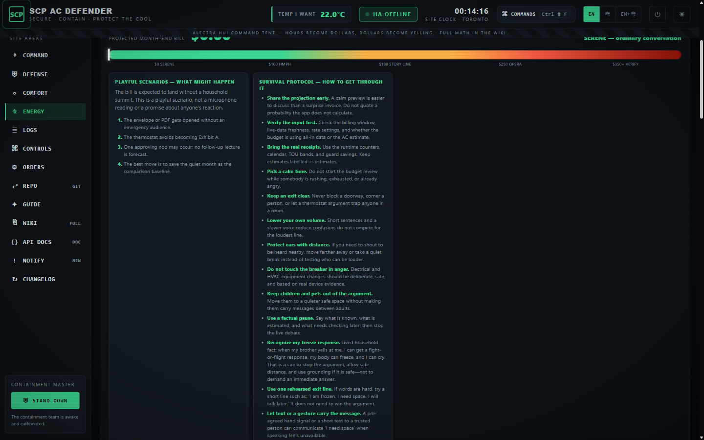

# Home Assistant AC Defender

An ASP.NET Core Blazor website plus a 24/7 background worker that watches a **real** Home
Assistant climate entity and defends the dining room AC target — *my temp* — against the AC
app's own schedule, phone changes, and wall touches, while staying polite, safe, and cheap
to run.

There is no simulator and no dummy thermostat: every control acts on the real Home Assistant
entity or shows a real error.


## What it does, in five ideas

1. **My temp is law.** Your chosen temperature is a hard floor. Warm rooms are walked back
   toward it in gentle 0.5 °C steps that start just under the current room temperature —
   never a suspicious snap.
2. **A team of guards, not one rule.** Dozens of small guards handle courtesy waits,
   tug-of-war truces, stealth timing, night shutdown, peak-power saving, emergency
   apologies, and more. Each one is a live card on the **Defense** page with a plain-English
   drawer, and each has a section in the in-app **Guide** — both generated from one source
   of truth in the code.
3. **People get courtesy; machines don't.** Human wall touches earn cooldowns, comfort
   grace, and natural-looking corrections. The AC vendor app's own temperature schedule
   (SLEEP → DEEP SLEEP → GOOD MORNING, quietly drifting the room to ~26 °C at 2 a.m.) is
   recognized by **Rival Schedule Watch** and answered back to my temp without the human
   niceties.
4. **Money awareness built in.** Real compressor hours are priced at Alectra time-of-use
   rates with **no power sensor needed**, shown under the runtime counters, on an
   airline-fare-style **usage calendar**, and steered by an optional **monthly budget**
   that eases cooling when you're spending too fast — never past a safety temperature.
5. **Safety always wins.** Hot rooms bypass every stealth wait, emergencies stop
   everything, and a front-door person detector can kill the AC instantly.
6. **Automatic thermostat-interaction risk cues.** A deterministic large-raise/touch-burst
   rule may apologize automatically, ease the AC up as a peace gesture, and stand down for
   two hours. Separately, the local learning model can extend later manual-change grace during
   previously labelled sensitive hours. Neither path has a microphone or claims certainty
   about a person's behaviour.
7. **A persistent human always wins.** The truce family: insist on the same warmer number
   three times and the defender adopts it for four hours (Repeated-Raise Surrender); a
   thermostat that vanishes mid-argument triggers the **ULTRA OMEGA ALERT** Tamper Truce —
   two hours of stand-down, not alarms; and a bedroom door sensor opening at dawn warms
   the target before the person reaches the hallway (Wake-Up Truce).
8. **Cooling failure needs proof before it touches the power switch.** A possible MEGA failure
   remains an alert; only an OMEGA-confirmed room-temperature rise may trigger the automatic
   OFF-and-recovery hold. If a person turns the AC back on, that choice wins for the rest of
   the failure episode.

| The money page | The usage calendar |
| --- | --- |
|  |  |

## Documentation

The full documentation lives in the **[wiki](docs/wiki/Home.md)** — start with the
**[Website Tour](docs/wiki/Website-Tour.md)**, a picture-book walk through every page that
anyone can follow.

The [GitHub Pages landing page](https://ding-ding-projects.github.io/HomeAssistantAcDefender/)
is built from `docs/` on every documentation change. Every branch push and manual dispatch run
the release workflow: it builds the Docker image for both `linux/amd64` and `linux/arm64`,
publishes separate loadable archives, SHA-256 checksums, and revision metadata records, and
records the CI-generated line-count table. GitHub Actions intentionally performs build,
packaging, and publication only; local checks remain available for development and are not release
claims.
It also builds the separate Windows controller with Squirrel.Windows and attaches its unsigned Setup.exe,
`.nupkg`, and `RELEASES` update-feed artifacts after static and non-empty-file checks. Release
notes include measured workflow start, completion, and duration values. The workflow ignores
its generated `v0.1.*` tag pushes so release publication cannot recursively create more releases.
The [release and
line-count guide](docs/wiki/release/line-counts.md) explains the artifact boundaries and how to
load the server image.

To run a release archive without rebuilding, load the host-architecture archive and select its
exact image reference from the adjacent `.metadata.json` file:

```powershell
docker load --input ac-defender-docker-<version>-arm64.tar.gz
$env:AC_DEFENDER_IMAGE = "ac-defender:<version>-arm64"
$env:AC_DEFENDER_VERSION = "<version>"
$env:AC_DEFENDER_REVISION = "<commit>"
docker compose up -d --no-build
```

The service exposes an anonymous, non-secret `GET /healthz` response for Compose and load
balancers. Forwarded HTTPS is accepted only when the deployment explicitly configures
`FORWARDED_HEADERS_KNOWN_PROXIES` or `FORWARDED_HEADERS_KNOWN_IP_NETWORKS` plus
`FORWARDED_HEADERS_ALLOWED_HOSTS` in the host `.env`; Compose maps those bounded values to the
application's `ForwardedHeaders__*` configuration. An empty trust list ignores forwarded headers.

For a clean Windows machine, `download-dependencies.bat /s` pins the canonical winget .NET SDK
10.0.301, .NET runtime 10.0.11, and Node.js v24.19.0, then `build.bat /s` builds both the server
and Windows controller.
`build-installer.bat /s` clears stale Squirrel output, clears signing inputs, verifies `NotSigned`
assets, and writes SHA-256/source-revision metadata. Pinned user-scoped portable ZIP fallbacks for
.NET SDK/runtime and Node.js are recorded in `dependency-manifest.json`; when neither winget nor
the verified portable fallback can supply a pinned tool, the scripts stop with the exact missing
tool rather than claiming a complete bootstrap. A fully fresh-machine bootstrap run remains an
open verification item.

| Page | What it covers |
| --- | --- |
| [Website Tour](docs/wiki/Website-Tour.md) | Every page, with screenshots, in plain words |
| [Algorithms](docs/wiki/Algorithms.md) | Search every AC Defender algorithm and open the full article for each one |
| [Every Guard, Explained Simply](docs/wiki/Every-Guard-Explained.md) | Every single algorithm, described so anyone can follow |
| [Energy & Costs](docs/wiki/Energy-and-Costs.md) | TOU rates, the sensor-free AC cost estimate, the calendar, the monthly budget |
| [Yelling Predictions](docs/wiki/Yelling-Predictions.md) | Ten bill story bands, more than forty playful scenarios, and a fourteen-stage lived freeze/cry/overthinking expectation ledger |
| [Yelling Survival Guide](docs/wiki/Yelling-Survival-Guide.md) | Fifty-two before, during, freeze-response, overthinking, recovery, and support survival moves |
| [Heat, Pain & Survival Facts](docs/wiki/Heat-Pain-and-Survival-Facts.md) | Sourced hearing, heat, personal-safety, fight-or-flight/freeze/cry, and extreme-overthinking facts |
| [Defender Logic](docs/wiki/Defender-Logic.md) | The decision cycle and every guard's exact rules |
| [Settings](docs/wiki/Settings.md) | Every knob on the Settings page |
| [Command palette](docs/wiki/Command-palette.md) | `Ctrl+Shift+F` keyboard navigation to every real app area |
| [Regex search builder](docs/wiki/Regex-search.md) | Bounded plain-text and opt-in .NET regex search on core navigation surfaces |
| [App tabs](docs/wiki/App-tabs.md) | Persisted browser-style route tabs with keyboard navigation and overflow-safe scrolling |
| [Context menus](docs/wiki/Context-menus.md) | Right-click, keyboard, and mobile press-and-hold tab editing with local menu search |
| [Changelog](docs/wiki/Changelog.md) | Every published version, date/regex filters, Markdown export, and commit traceability |
| [Notification history](docs/wiki/Notification-history.md) | Review, dismiss, and restore activity notices without losing the audit trail |
| [Thermostat OFF super-confirmation](docs/wiki/Super-confirmation.md) | Native two-key, full-slider gate for the real destructive OFF command |
| [Appearance editor](docs/wiki/Appearance-editor.md) | Persisted theme, density, HEX/RGB/HSL/alpha color translation, contrast readouts, CJK-safe typography, live preview, and reset |
| [Dim-sum startup surprise](docs/wiki/Dim-sum-surprise.md) | One exact 10% post-boot delight using public catalog metadata and immutable photo URLs |
| [API](docs/wiki/API.md) | JSON endpoints and the `/api/status/stream` SSE feed |
| [Architecture](docs/wiki/Architecture.md) | How the code is put together |
| [Deployment](docs/wiki/Deployment.md) | Docker, volumes, and the full environment-variable reference |

## Quick start

### Docker (recommended)

```powershell
# 1. Configure
cp .env.example .env     # fill in the Home Assistant values below

# 2. Run (publishes on host port 8888)
docker compose up -d --build
```

Required environment variables:

```text
# Development-only loopback HTTP; production must use the real HTTPS Home Assistant API URL.
HomeAssistant__BaseUrl=http://127.0.0.1:8123
HomeAssistant__AllowInsecurePrivateNetworkHttp=false
HomeAssistant__EntityId=climate.dining_room
HomeAssistant__AccessToken=replace-with-token
# Exact reverse-proxy trust boundary; production must replace these placeholders.
FORWARDED_HEADERS_KNOWN_PROXIES=127.0.0.1
FORWARDED_HEADERS_KNOWN_IP_NETWORKS=
FORWARDED_HEADERS_ALLOWED_HOSTS=localhost
```

Non-loopback Home Assistant URLs must use HTTPS. The narrowly scoped
`HomeAssistant__AllowInsecurePrivateNetworkHttp=true` compatibility switch is accepted only for
RFC1918, link-local, or `.local` private targets and never permits public HTTP. It exposes the
bearer token over cleartext on that private network, so production should use HTTPS instead.
The deployment script also requires a mode-600, deployment-account-owned `.env`, an exact
allowed-host list, at least one exact trusted proxy IP or CIDR, and `AC_DEFENDER_RELEASE_TAG`
for the immutable public release whose independently reported asset digest must match the archive.
It verifies rollback image/version/revision metadata and `/healthz` rather than swallowing a
rollback failure.

Open `http://localhost:8888` — the first account you create becomes the owner. This local route
uses `FORWARDED_HEADERS_ALLOWED_HOSTS=localhost`; any remote, LAN, or public deployment must
replace that value with its exact hostname or IP before startup. Wildcard hosts are rejected. All optional
entities (weather, outdoor temperature, Alectra Hui usage sensors) and every `Defender__*`
tuning knob are listed in [Deployment](docs/wiki/Deployment.md).

### Local development

```powershell
dotnet build                                   # build
dotnet run --urls http://127.0.0.1:8888        # run the site
dotnet run --project HomeAssistantAcDefender.Tests/HomeAssistantAcDefender.Tests.csproj   # regression suite
```

### CLI (no web server)

```powershell
dotnet run -- usage-live
dotnet run -- usage-history --hours 24
```

## The website

Routed pages behind a responsive navigation drawer, all sharing one per-second live
snapshot — no refreshing, ever:

- **Command Center** (`/`) — my temp, the live wall unit, runtime hours **with estimated
  dollars**, direct orders, and the master switch.
- **Defense** (`/defense`) — every guard as a live card with "How this works" and
  extra-specific decision drawers.
- **Comfort** (`/comfort`) — the upstairs heat check with presence awareness.
- **Energy** (`/energy`) — costs, Alectra Hui intel, charts, and the AC usage **Calendar**.
- **Logs** (`/logs`) — the wall-touch audit trail with source attribution
  (person / phone / automation / rival schedule) and JSON detail.
- **Controls** (`/controls`) — target, fan, force, off, and emergency buttons.
- **Settings** (`/settings`) — every guard's dials, the **Electricity budget** switch, and
  the schedule editor.
- **Command palette** (`Ctrl+Shift+F`) — keyboard navigation to each real destination without
  bypassing authentication or thermostat safety gates.
- **Open tabs** — persisted browser-style route tabs complement the full rail, keep the active
  route visible through overflow, expose arrow/Home/End keyboard navigation, and support a stable
  pinned region plus bounded local group labels, four independent searches, and protected
  containing/inverse bulk-close previews.
- **Context menus** — every signed-in tab, group, control, card, navigation target, and page surface
  has a locally searchable, opaque, viewport-bounded menu. Right-click or `Shift+F10`; mobile and pen
  users press and hold a tab. Active, pinned, and command fallback tabs retain close protection.
- **Regex search builder** — plain text remains the default while the command palette, Defense
  roster, and Field Manual expose bounded local .NET regex builders with timeout protection.
- **Release changelog** (`/changelog`) — every published version with date and regex filters,
  exact commit links, legacy-metadata warnings, and filtered Markdown export.
- **Notification history** (`/notifications`, backed by `/api/notifications`) — authenticated
  review, search, typed date windows, action counts, dismiss, restore, and local JSON/Markdown
  export of real activity notices; it never invents thermostat state.
- **Thermostat OFF super-confirmation** — both Dashboard and Controls show the exact affected
  device and command, require two independent keys plus a full slider, and support Emergency exit,
  Escape, focus return, reduced motion, and truthful Home Assistant failure reporting.
- **Appearance editor** (`/settings`) — persisted light/dark theme, density, accent, CJK-safe
  font family, bounded UI scale, live shell application, and reset without changing HVAC logic.
- **Dim-sum startup surprise** — after boot, one fresh 10% draw may show a bilingual dish card
  with accessible alt text and a public catalog photo; it is non-blocking, auto-dismisses, and
  never vendors an image.
- **Windows Electron controller** (`desktop-electron/`) — a separate Windows client for the
  hosted service. It signs in through the real `/login` flow, reads `/api/status`, and sends
  authenticated commands; defender logic remains on the server.
- **Guide** (`/guide`) — the built-in manual, generated from the guard catalog.

See the [Website Tour](docs/wiki/Website-Tour.md) for all of it with screenshots.

## Development notes

- Run `dotnet build` before pushing; run the regression suite for logic changes.
- Run `python scripts/count_lines.py` when a release or handoff needs a line-count report;
  CI runs that same committed script at the exact release commit.
- Do not commit `.env`, `App_Data`, build output, deployment archives, or Home Assistant
  tokens.
- `AGENTS.md` holds the safety rules every guard must respect (no fake state, my temp is a
  hard floor, safety bands always win).
