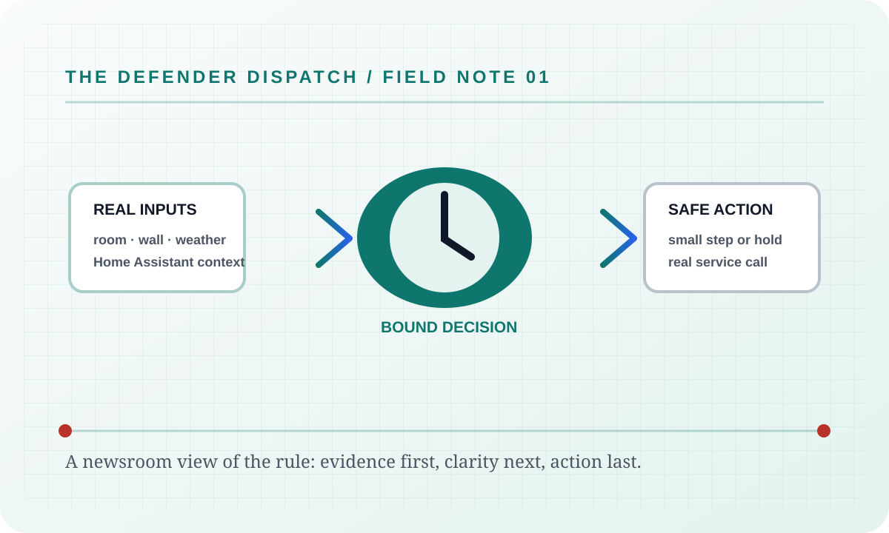

The complete beat sheet

# Feature briefs

This is the documentation desk's **complete index**, not a highlights reel. Every shipped
feature has a linked article with its behavior, configuration, failure modes, security and
privacy notes, verification evidence, and suggested next reads. Algorithm articles are
small field notes; product surfaces are longer operator briefings.

  

    <h2>Follow the evidence, one feature at a time.</h2>
    
Search by guard, page, control, endpoint, release tool, or Windows controller capability. Plain text is the default; the adjacent builder can switch this index to a bounded regular expression.

  

  

  <label for="feature-search">Search every feature article</label>
  
<input id="feature-search" data-search-input type="search" placeholder="Try notifications, energy, update feed, guard, API, or settings"><button type="button" data-search-clear aria-label="Clear feature search">Clear</button>

  
0 feature articles shown

  
No feature article matches that search.

  

    
    
      
      <article class="algorithm-card category-system" data-search-item data-search-text="{{ feature.title }} {{ feature.description | default: '' | escape }}">
        
BriefEvidence-led

        <h3><a href="{{ feature.url | relative_url }}">{{ feature.title }}</a></h3>
        
{{ feature.description | default: "A complete feature note with behavior, configuration, failure, security, and verification details." }}

        
<strong>Article contract:</strong> behavior · configuration · failure modes · security · verification · suggested articles

      </article>
      
    
  

## How to read a feature brief

Each article separates the user-visible behavior from the settings and the boundaries that
keep a real thermostat safe. A failure is described as a failure, not softened into a
spinner. Verification points to the relevant app surface, tests, or release evidence. The
docs site itself has no analytics, no tracking pixels, and no credentials: it is a static
publication of the project's public contract.

## Operator safety note

The articles never authorize a simulated climate entity. The hosted service controls the
configured Home Assistant entity or returns Home Assistant's real error. If an input is
missing, a guard may stand down or hold a correction, but it does not invent a temperature,
weather sample, energy reading, or audit event.

## Failure modes

The index can be unavailable when the Pages build is unavailable, an article has a broken
link, or a feature is not present in the current release tree. Those are publication
failures, not reasons to invent a feature summary. The hosted service's own failure modes
remain in the linked article and are never hidden behind this index.

## Security considerations

This static index contains public documentation only. It has no analytics, third-party
scripts, remote fonts, or credentials. Search text is evaluated in the browser and is not
sent to a server. Readers should still redact real entity names and timestamps from copied
logs or screenshots before sharing them.

## Verification

The Pages workflow must build the Jekyll source successfully, every linked article must
resolve, and the feature count must match the current `site.pages` catalogue. Review the
index at desktop and 390 px widths, open the command palette with <kbd>Ctrl+Shift+F</kbd>,
and exercise an invalid regex to confirm the honest error state remains visible.

## Suggested articles

- [Algorithms](Algorithms.html) — open the guard desk and search every algorithm.
- [Defender Logic](Defender-Logic.html) — trace the decision pipeline and bypass rules.
- [Website Tour](Website-Tour.html) — see where each feature appears in the application.
